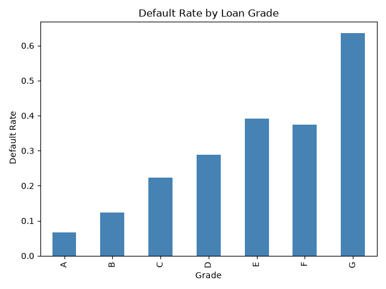

# ai-finance-fluency 
Six month project to build an applied AI fluency in a finance context starting with a credit default risk proof of concept
# Status
Day 1 - Environmental setup
## Goal
Month 1: working notebook that predicts loan default and beats a baseline.

# Credit Risk Prediction — Proof of Concept

A machine learning project predicting loan default risk using LendingClub loan data, built as a proof of concept in AI/data fluency for finance applications.

## Problem

Can we predict, using only information known at loan issuance, whether a loan will default? And can we do so honestly — beating a naive baseline, not just achieving a high-sounding accuracy number?

## Data

LendingClub loan-level data (`loans.csv`, ~2.26M rows, 145 columns). This proof of concept samples 5,000 loans for speed; the pipeline generalizes to the full dataset.

## Method

1. **Cleaning**: handled missing data (dropped columns with high missingness where not critical), fixed data types (dates, ordered categoricals for loan grade), cleaned messy text columns (stripped units, normalized case).
2. **Target definition**: `is_default` = 1 for Charged Off, 0 for Fully Paid loans; excluded loans still in progress (Current, Late, In Grace Period) since their outcome isn't known yet.
3. **Leakage avoidance**: explicitly excluded post-outcome columns (`total_rec_prncp`, `recoveries`, etc.) that are only populated after a loan resolves — confirmed empirically that these columns' averages differ sharply by outcome, proving they'd let a model "cheat."
4. **Features**: `loan_amnt`, `int_rate`, `annual_inc`, `term_months` — all known at loan issuance. `grade` was tested and dropped after finding 0.95 correlation with `int_rate` (multicollinearity), with negligible AUC cost (0.729 → 0.726).
5. **Modeling**: trained logistic regression (final model) and random forest (comparison) on an 80/20 stratified train/test split.
6. **Evaluation**: used AUC and threshold-tuned precision/recall rather than raw accuracy, since ~19% class imbalance makes accuracy misleading (a "never predict default" rule ties the model's accuracy exactly).

## Results

- **AUC**: 0.726 (logistic regression) vs. 0.716 (random forest) vs. 0.5 (random baseline).
- **At threshold 0.4**: 81.6% accuracy, 60.9% precision, 12.5% recall — better than the default 0.5 threshold on every metric.
- **Final model**: logistic regression, chosen over random forest for comparable performance plus interpretability — relevant given fair lending regulations (ECOA) that require explainable credit decisions.

## Limitations

- Recall remains low (12.5% at the chosen threshold); catching more real defaults requires accepting substantially more false alarms, a trade-off that depends on real dollar costs not present in this dataset.
- Small sample (5,000 of 2.26M available rows); results may not hold at full scale.
- Train/test split is random, not chronological — a production model would need testing against genuinely future loans.
- Only 4 features used; a production model would likely use dozens, including credit history and behavioral data.

## Project Log

Day-by-day build log, including bugs hit and how they were diagnosed: [LOG.md](LOG.md)